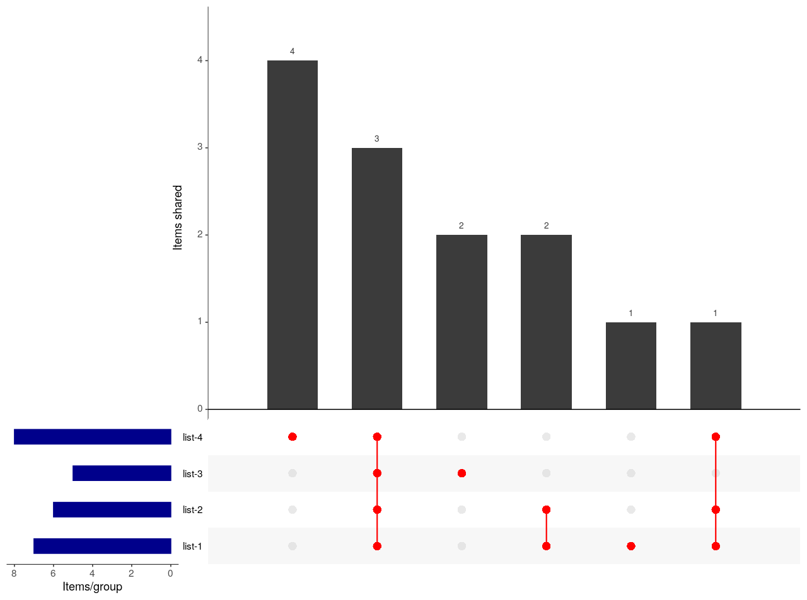

# Code example for UpSetR

I have generated some functions to speed the use of UpsetR, here I show the usage of them.

## What is UpsetR?

Upset is a very useful data vizualition package develop few years ago and available [here](https://upset.app/). The idea behind UpSet is to make the intersection sizes easy to compare. 

It allows a better interpretation specially when there are more than 3 intersections generating VennDiagram really difficult to interpret. It was inspired by the infamous [six-set banana venn diagram](https://upset.app/about/). 

There are multiple [implementations](https://upset.app/implementations/) of the code in several programming languages, luckily for us in R: UpsetR. More information on the UpsetR package available [here](https://github.com/hms-dbmi/UpSetR) and/or [here](https://cran.r-project.org/web/packages/UpSetR/vignettes/basic.usage.html)

## What do I do here in `HCGB.IGTP.DAnalysis`?

`HCGB.IGTP.DAnalysis` is a package to easily use and speed the usage of some functions.

Regarding UpsetR I have specifically created functions here: [R/UpSetR_functions.R](https://github.com/HCGB-IGTP/HCGB.IGTP.DAnalysis/blob/bf31e9187d0fedb878d2bda63fd158220f23db2a/R/UpSetR_functions.R)

## Install packages

Install neccessary packages:

- UpSetR

```R
### install UpSetR if not installed and loaded it
install.packages("UpSetR")
library(UpSetR)
```

- HCGB.IGTP.DAnalysis

`HCGB.IGTP.DAnalysis` is not available in CRAN or Bioconductor, it is just available as a set of functions that I use on a daily basis.

Try to install `HCGB.IGTP.DAnalysis` following the steps, if you have any issues, just copy paste functions

To install packages from github, you need to install it using `devtools` packages firts.

```R
## install devtools if not installed
install.packages("devtools")

## install HCGB R package
devtools::install_github("HCGB-IGTP/HCGB.IGTP.Danalysis")

## load it
library(HCGB.IGTP.Danalysis)
```

If it fails, the functions necessary are here: [R/UpSetR_functions.R](https://github.com/HCGB-IGTP/HCGB.IGTP.DAnalysis/blob/bf31e9187d0fedb878d2bda63fd158220f23db2a/R/UpSetR_functions.R):


## Toy Example UpsetR

`UpsetR::upset()` is the function that creates the visualization and it basically requires a datafarme containing items as rows and sets as columns. For the presence/absence of an item in a category, they require 1/0 code.

I have implemented a function to create this type of dataframe from a set of list provided which is `create_upset_data()`. Then, I created a shortcut to `UpsetR::upset()` which is `create_upset_plot()` and uses the dataframe and the names of each set to use. This function, returns the plot and the dataframe, that you can easily dump into a csv/excel file to better identify intersections.

On the other hand, as I usually dump list of items (genes, samples, whatever,...) using linux, python or other, into a folder, I created a function that retrieves all files (with a given pattern) in a folder and directly creates the upset plot.

### 1) UpsetR from list of items

```R

## Create example set of lists
list.1 <- c("a", "b", "c", "d", "e", "f", "g")
list.2 <- c("a", "b", "c", "d", "e", "g")
list.3 <- c("a", "b", "c", "h", "m")
list.4 <- c("a", "b", "c", "g", "i", "j", "k", "l")

list.of.list <- list(
  "list.1" = list.1,
  "list.2" = list.2,
  "list.3" = list.3,
  "list.4" = list.4
)


## create a matrix/dataframe of presence/absence (0/1) for each
## list and each item: create_upset_data
df.presence <- create_upset_data(list.of.list)
df.presence
```

`df. presence` contains 0/1 for each list and item:


```R
## Create plot: create_upset_plot
## Use df.presence generated and names for each set
create_upset_plot(data_set = df.presence, sets = names(df.presence))
```




### 2) UpsetR from folder containing files with IDs, genes, names, whatever

```R

## Create plot from folder: read files, inherit names from file.names and create upset plot
## use function: create_upset

##----------------------------
## Save example list generated before or use other example
##----------------------------
test_upset.folder <- "test_UpsetR" ## created in your current working directory
dir.create(test_upset.folder)

write.table(list.1, file = file.path(test_upset.folder, "list-1.example.txt"), 
            row.names = FALSE, quote = FALSE, col.names = FALSE)
write.table(list.2, file = file.path(test_upset.folder, "list-2.example.txt"), 
            row.names = FALSE, quote = FALSE, col.names = FALSE)
write.table(list.3, file = file.path(test_upset.folder, "list-3.example.txt"), 
            row.names = FALSE, quote = FALSE, col.names = FALSE)
write.table(list.4, file = file.path(test_upset.folder, "list-4.example.txt"), 
            row.names = FALSE, quote = FALSE, col.names = FALSE)
##----------------------------

## Create:
# get files with given pattern, create dataframe, create matrix and create plot
upset_generated <- create_upset(data_dir = test_upset.folder, 
             pattern2search = ".example.txt")
##----------------------------
```
