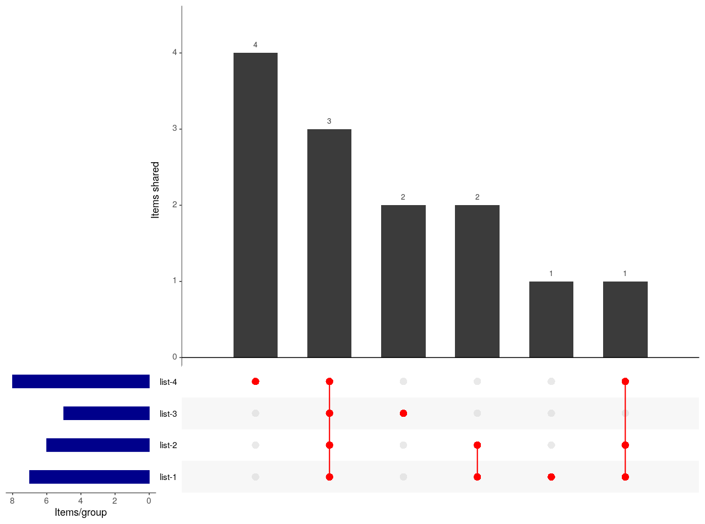

# Code example for WGCNA

I have generated some functions to speed the use of WGCNA, here I show the usage of them.

## What is WGCNA?

...

## What do I do here in `HCGB.IGTP.DAnalysis`?

`HCGB.IGTP.DAnalysis` is a package to easily use and speed the usage of some functions.

Regarding WGCNA I have specifically created functions here: [R/WGCNA_functions.R](https://github.com/HCGB-IGTP/HCGB.IGTP.DAnalysis/blob/bf31e9187d0fedb878d2bda63fd158220f23db2a/R/UpSetR_functions.R)

## Install packages

Install neccessary packages:

- WGCNA

```R
### install UpSetR if not installed and loaded it
install.packages("WGCNA")
library(WGCNA)
```

- HCGB.IGTP.DAnalysis

`HCGB.IGTP.DAnalysis` is not available in CRAN or Bioconductor, it is just available as a set of functions that I use on a daily basis.

Try to install `HCGB.IGTP.DAnalysis` following the steps, if you have any issues, just copy paste functions

To install packages from github, you need to install it using `devtools` packages firts.

```R
## install devtools if not installed
install.packages("devtools")

## install HCGB R package
devtools::install_github("HCGB-IGTP/HCGB.IGTP.Danalysis")

## load it
library(HCGB.IGTP.Danalysis)
```

If it fails, the functions necessary are here: [R/WGCNA_functions.R](https://github.com/HCGB-IGTP/HCGB.IGTP.DAnalysis/blob/bf31e9187d0fedb878d2bda63fd158220f23db2a/R/UpSetR_functions.R):


## Toy Example UpsetR

`UpsetR::upset()` is the function that creates the visualization and it basically requires a datafarme containing items as rows and sets as columns. For the presence/absence of an item in a category, they require 1/0 code.

I have implemented a function to create this type of dataframe from a set of list provided which is `create_upset_data()`. Then, I created a shortcut to `UpsetR::upset()` which is `create_upset_plot()` and uses the dataframe and the names of each set to use. This function, returns the plot and the dataframe, that you can easily dump into a csv/excel file to better identify intersections.

On the other hand, as I usually dump list of items (genes, samples, whatever,...) using linux, python or other, into a folder, I created a function that retrieves all files (with a given pattern) in a folder and directly creates the upset plot.

### 1) UpsetR from list of items

```R

## Create example set of lists
list.1 <- c("a", "b", "c", "d", "e", "f", "g")
list.2 <- c("a", "b", "c", "d", "e", "g")
list.3 <- c("a", "b", "c", "h", "m")
list.4 <- c("a", "b", "c", "g", "i", "j", "k", "l")

list.of.list <- list(
  "list.1" = list.1,
  "list.2" = list.2,
  "list.3" = list.3,
  "list.4" = list.4
)


## create a matrix/dataframe of presence/absence (0/1) for each
## list and each item: create_upset_data
df.presence <- create_upset_data(list.of.list)

```

`df.presence` is a dataframe that contains 0/1 for each list and item:

```R
print(df.presence)

  list.1 list.2 list.3 list.4
a      1      1      1      1
b      1      1      1      1
c      1      1      1      1
d      1      1      0      0
e      1      1      0      0
f      1      0      0      0
g      1      1      0      1
h      0      0      1      0
m      0      0      1      0
i      0      0      0      1
j      0      0      0      1
k      0      0      0      1
l      0      0      0      1
```

Now, create the plot:

```R
## Create plot: create_upset_plot
## Use df.presence generated and names for each set
upset_plot <- create_upset_plot(data_set = df.presence, sets = names(df.presence))
```




To better interpret this plot, check additional details in the UpSet Explained section [here](https://upset.app/). 

Basically, 
- each row corresponds to a set (a list) and the bar charts on the left show the size of the set (number of items in each set).
- each colum corresponds to a possible intersection: again, the bar charts, show the size of the intersection.
- the filled-in cells show which set is part of an intersection. Notice the lines connecting the filled-in cells, as not all sets might be present in an intersection.

As a summary of the results, we can see how
- list 4 contains 4 items which are unique of list 4.
- there are 3 items shared by all samples. 
- list 3 contains 2 items which are unique of list 3.
- there are 2 items shared between list 2 and list 1
- list 1 contains 1 item unique of this list,
- there is a last item, which is shared by 3 sets.


### 2) UpsetR from folder containing files with IDs, genes, names, whatever

```R

## Create plot from folder: read files, inherit names from file.names and create upset plot
## use function: create_upset

##----------------------------
## Save example list generated before or use other example
##----------------------------
test_upset.folder <- "test_UpsetR" ## created in your current working directory
dir.create(test_upset.folder)

## save the 4 previous list as single files
write.table(list.1, file = file.path(test_upset.folder, "list-1.example.txt"), 
            row.names = FALSE, quote = FALSE, col.names = FALSE)
write.table(list.2, file = file.path(test_upset.folder, "list-2.example.txt"), 
            row.names = FALSE, quote = FALSE, col.names = FALSE)
write.table(list.3, file = file.path(test_upset.folder, "list-3.example.txt"), 
            row.names = FALSE, quote = FALSE, col.names = FALSE)
write.table(list.4, file = file.path(test_upset.folder, "list-4.example.txt"), 
            row.names = FALSE, quote = FALSE, col.names = FALSE)
##----------------------------

## Create all at once:
# get files with given pattern, create dataframe, create matrix and create plot
upset_generated <- create_upset(data_dir = test_upset.folder, pattern2search = ".example.txt")
```

The results not shown here is the same plot as before. We set to only retrieve files containing ".example.txt" and creates steps to create plot.

The object `upset_generated`contains several objects:
```R
names(upset_generated)
[1] "upset_plot" "listFiles" 
```

`upset_generated$upset_plot` contains information of the plot and the dataset (dataframe, the same as `df.presence` before) and `listFiles` contains all the input sets retrieved from files.


#---------------------
# Option 1: Static module selection
#---------------------
sft.RMA$plot_scale
sft.RMA$plot_scale$data[which.max( sft.RMA$plot_scale$data$SFT.R.sq) ,]

blockwise_RMA_Hsapiens <- wgcna_blockwiseModules(picked_power = 9, input_data.mat = input_data.mat.rma, 
                                                 tag_name = "RMA_Hsapiens_miRNA", plot_dir = res_dir)

# Get Module Eigengenes per cluster
eigen_cor_rma_Hsapiens <- wgcna_eigengenes_module(input_data.mat = input_data.mat.rma, colors2use = blockwise_RMA_Hsapiens$mergedColors, 
                                                  sample_sheet_given = new_sample_sheet, plot_dir = res_dir,  tag_name = "RMA_Hsapiens_miRNA")

wgcna_labeledHeatmap(MEs0_res = eigen_cor_rma_Hsapiens$MEs0_res, moduleTraitCor_res = eigen_cor_rma_Hsapiens$moduleTraitCor_res, 
                     moduleTraitPvalue_res = eigen_cor_rma_Hsapiens$moduleTraitPvalue_res, 
                     sample_sheet_given = new_sample_sheet, plot_dir = res_dir, tag_name = "RMA_Hsapiens_miRNA")
#--------

#---------------------
# Option 2: Dynamic module selection
#---------------------

dynamic_RMA <- wgcna_dynamicModules(picked_power = 9, input_data.mat = input_data.mat.rma, 
                                    tag_name = "RMA_Hsapiens_miRNA", plot_dir = res_dir)

# Get Module Eigengenes per cluster
eigen_cor_RMA_dyn <- wgcna_eigengenes_module(input_data.mat = input_data.mat.rma, 
                                             colors2use = dynamic_RMA$dynamicColors, 
                                             sample_sheet_given = new_sample_sheet, plot_dir = res_dir, tag_name = "RMA_Hsapiens_miRNA_dyn")

wgcna_labeledHeatmap(MEs0_res = eigen_cor_RMA_dyn$MEs0_res,
                     moduleTraitCor_res = eigen_cor_RMA_dyn$moduleTraitCor_res, 
                     moduleTraitPvalue_res = eigen_cor_RMA_dyn$moduleTraitPvalue_res, 
                     sample_sheet_given = new_sample_sheet, plot_dir = res_dir, tag_name = "RMA_Hsapiens_miRNA_dyn")
#---------------------

